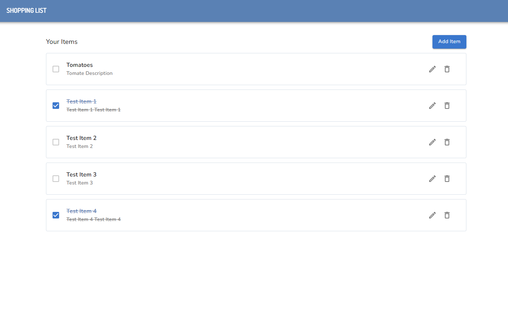

# Challenge
Implement a full-stack shopping list using the provided mocks. The shopping list can add, edit, and remove shopping items. 

## How to run

- Node version `18.20.4` is recommended

### Backend

- Stack
    * Node/Express
    * Sqlite3/Sequelize (chosen for easy local testing and demonstration purposes for reviewers, but Postgres was recommended in the requirement)
- Code is in [backend](./backend/) directory
- `npm install` for the installation
- `npm start` for running the server
- The server is running on port `3001` by default. You can change this in the [index.js](./backend/index.js#L7) file.
- The [db](./backend/db/) directory contains the SQLite database file [shopping-list.db](./backend/config/sequelize.js#L5). This file is generated on the first run and contains pre-defined data for testing. You can reset the database by deleting this file and restarting the server.

### Frontend

- Stack
    * React / Context
    * Axios
    * Material UI
- Code is in [frontend](./frontend/) directory and bootstrapped with [Create React App](https://create-react-app.dev/docs/getting-started)
- `npm install` for the installation
- `npm start` for running the server
- FE is running on port `3000` by default

## TODO / Possible improvement with More Time

### Backend
- Managed the database with the file in the [db](./backend/db/) directory for easier review and demonstration. Consider properly configuring the DB to use Postgres as recommended.

### Frontend
- Centralize/Improve styling on the frontend:
  * Move inline styles into the Theme provider to ensure consistent design across the app.
  * Define and reuse MUI variants for components like buttons, inputs, etc., to avoid redundancy and improve maintainability.
- Refactor API handling:
  * Separate API logic into utility functions (e.g., inside a `services` or `api` folder), so that the Context file focuses on managing state rather than handling HTTP requests.
- Configure environment variables properly.